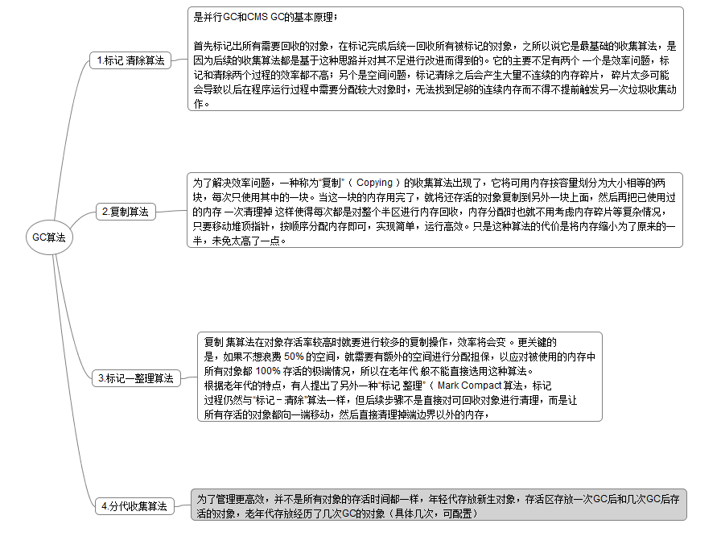
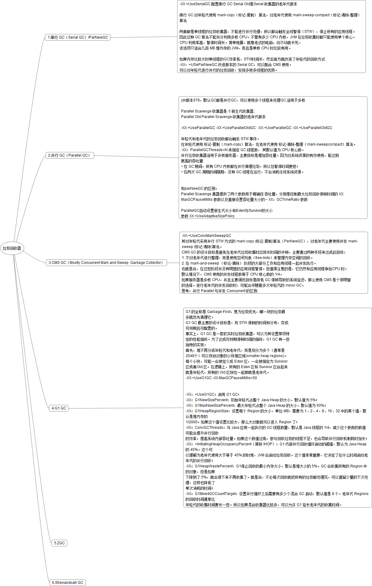
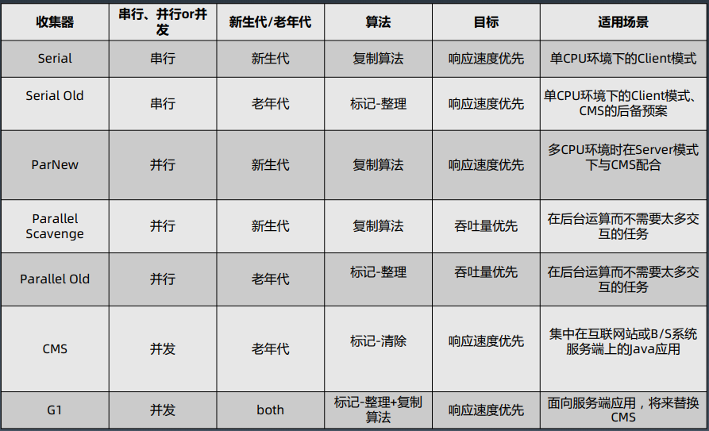

## 一.GC基础知识

### 1.对象存活分析

### 2.GC算法

### 3.垃圾回收器

 

## 二.GC优化的目的

1.解决一部分的内存溢出问题

​     当进程的内存无法再扩大时，合理的Eden，S0,S1,老年代的大小设置，能提高内存的利用率，合适的区域选择 合适的垃圾回收器

查看内存各部分使用命令：

​            jstat    -gcnew 年轻代的统计信息。  

​            jstat    -gcnewcapacity 年轻代空间大小统计    

​            jstat    -gcold 老年代和元数据区的行为统计    

​            jstat    -gcoldcapacity old 空间大小统计    

​            jstat   -gcmetacapacity meta 区大小统计    

​            jstat    -gcutil GC 相关区域的使用率（utilization）统计    

​            jstat   -printcompilation 打印 JVM 编译统计信息

配置内存各部分的大小：

-Xms：java Heap初始大小， 默认是物理内存的1/64。

-Xmx：ava Heap最大值，不可超过物理内存。
-Xmn：young generation的heap大小，一般设置为Xmx的3、4分之一 。增大年轻代后,将会减小年老代大小，可以根据监控合理设置。
-Xss：每个线程的Stack大小，而最佳值应该是128K,默认值好像是512k。
-XX:PermSize：设定内存的永久保存区初始大小，缺省值为64M。
-XX:MaxPermSize：设定内存的永久保存区最大大小，缺省值为64M。
-XX:SurvivorRatio：Eden区与Survivor区的大小比值,设置为8,则两个Survivor区与一个Eden区的比值为2:8,一个Survivor区占整个年轻代的1/10

垃圾回收器的选择：

2.当要求低延迟，更高的响应速度时，选择合适的垃圾回收器，降低程序运行时系统由于垃圾回收造成的STW时间
